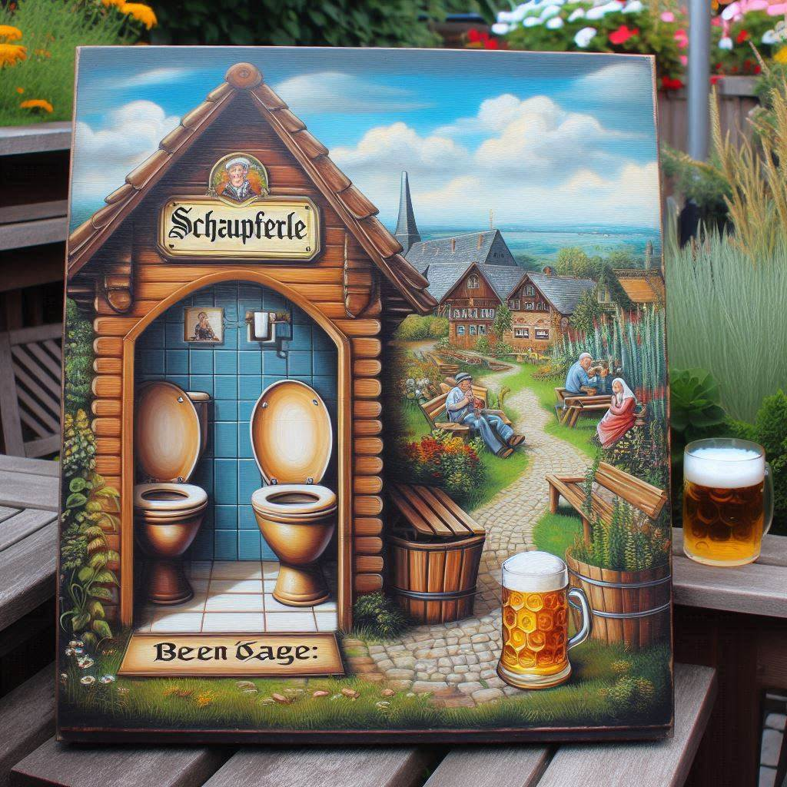
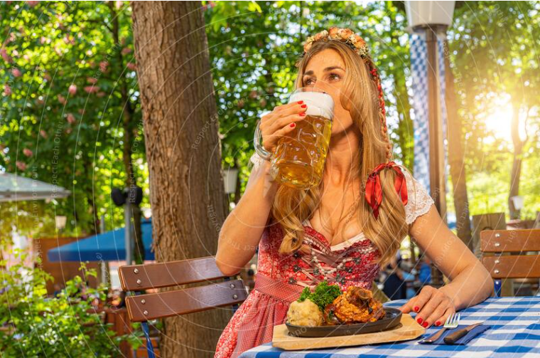

# Gutschein für Christoph

Lieber Christoph zu deinem Geburtstag wollen wir euch zum Schäuferle Essen bei uns einladen... Ich dachte ich mach einen hübschen Gutschein und wollte dazu mit DALL-E 3 ein aussagekräftiges Bild generieren.

Auf den Prompt:
```
Erstelle ein Bild mit einem Schäuferle mit Klos, Bier und Garten im Hintergrund
```
Hat die Wundermaschine folgendes ausgespuckt:

Naja, ich hoffe du verstehst trotzdem was gemeint ist ;)

Dagegen trifft eine kurze Google Suche schon eher meine Vorstellungen...


## Naja es wird wohl weder so noch so,
aber ich hoffe du freust dich trotzdem auf nen schönen Nachmittag bei uns.

Wähle einfach einen Termin und gib uns Bescheid:
- [ ] 21. July
- [x] 11. August
- [ ] 18. August
- [ ] ...


**Wünsche und Anregungen** bitte über
https://github.com/reserschnell/GutscheinFuerChristoph beitragen.
